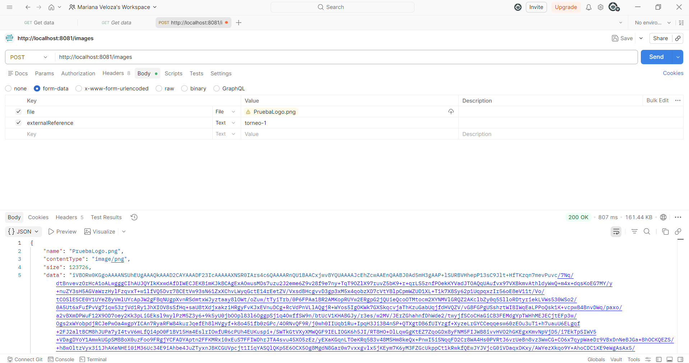
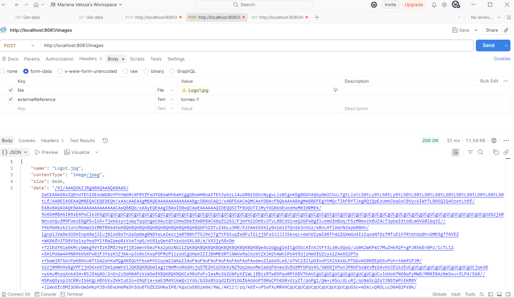
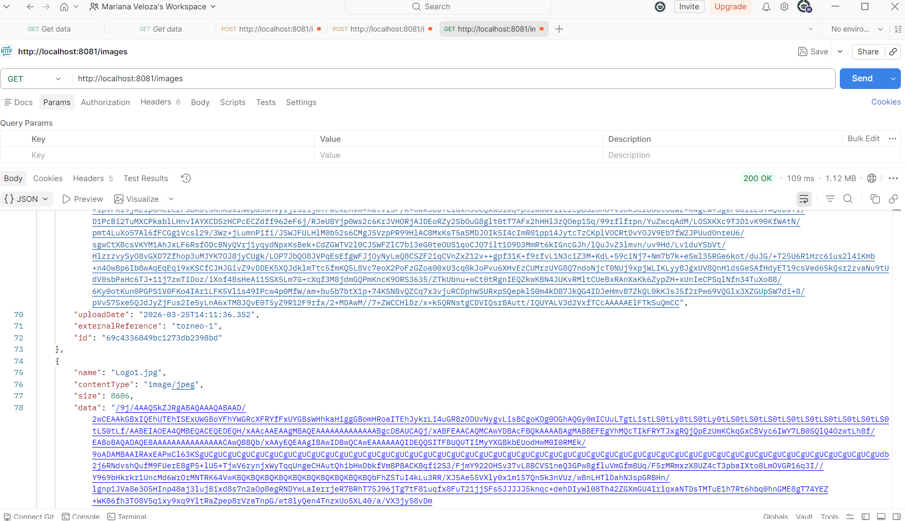
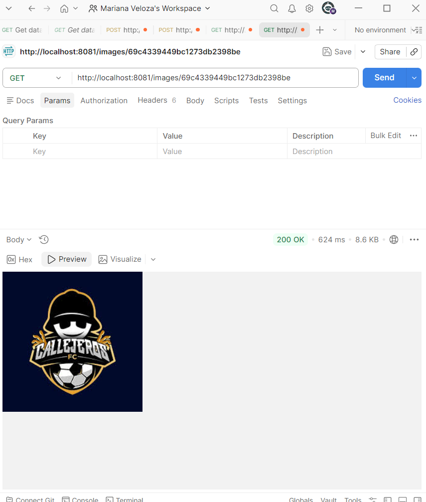
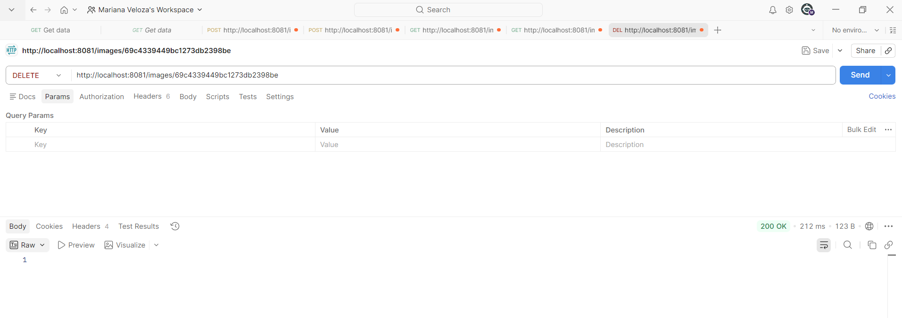
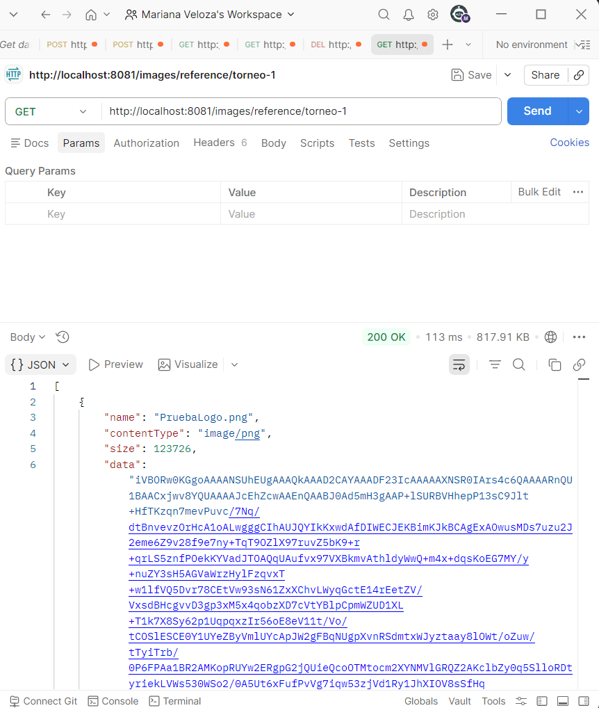

Repositorio image-service

**Integrantes**

Luiza Gonzalez
Eduardo Rico
Juan Roa
Karol Rodriguez
Juan Moreno

----
Pruebas

URL: http://localhost:8081/images

1. Subir una imagen

2. Listar imágenes.

3. Consultar una imagen por id.
id : 69c4339449bc1273db2398be

4. Eliminar una imagen.

5. Listar imágenes por referencia externa.

